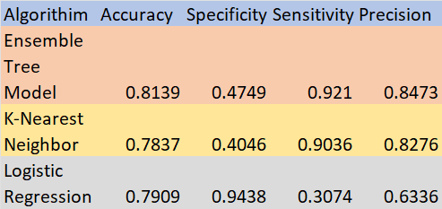

```{r setup, include=FALSE}
knitr::opts_chunk$set(echo = TRUE)
```

```{r}
rsconnect::setAccountInfo(name='ametr5', token='ECB557A74124C655952F9BB02EC4CDA2', secret='awhGnuj+Tk7THc09Hs9SxW9+ebqhfCPwUFHeBu7m')
```


```{r}
library(readr)
myData <- read_csv("Term_Project2.csv")
View(myData)
```

```{r}
library(caret)
library(gains)
library(pROC)
library(dplyr)
library(randomForest)
```

```{r}
Set1 <- subset(myData,myData$COUNTYFP > 0)
```

```{r}
Set2 <- Set1[ -c(1,2) ]
```
## Correlation Table
```{r}
Res <- cor(Set2)
round(Res, 2)
```
## Barplot
```{r}
Counts <- table(Set2$COUNTYFP)
barplot(Counts, main="Observations per County",
        xlab="County Label",
        ylab="Number of Observations",
        col = c("red"))
```


```{r, include=FALSE}
table(Set2$COUNTYFP)
```
## Logistic Model 
```{r}
Logistic_Model <- glm(OWNERSHP~., family = binomial(link = logit), data = Set2)
summary(Logistic_Model)
```

```{r, include=FALSE}
# Predict Function to Compute the Predicted Probabilities
Pred <- predict(Logistic_Model, type = "response")
```

```{r}
# Use the Round Function to Construct the Binary Predicted Values
Binary <- round(Pred)
```

```{r}
# Both OWNERSHP and Binary now Contain 0 And 1 Values
# We Want to Find the Proportion of the Values in the Sample for which OWNERSHP Equals Binary 
# Recall That the Double Equal Sign (==) is Used to Compare the Values of OWNERSHP and Binary 
# If the Two Values are the Same, the Operator Returns 1, and 0 Otherwise 
# We Use the Mean Function to Compute the Proportion of Correctly Classified Observations
# We Multiply by 100 to Get a Percentage
100*mean(Set2$OWNERSHP == Binary)
```

```{r}
threshold=0.5
predicted_values<-ifelse(predict(Logistic_Model,type="response")>threshold,1,0)
actual_values<-Logistic_Model$y
conf_matrix<-table(predicted_values,actual_values)
conf_matrix
```

```{r}
sensitivity(conf_matrix) #30.74
specificity(conf_matrix) #94.38
precision(conf_matrix) #63.36
```

```{r}
# Cross-Validation
myControl <- trainControl(method = "cv", number = 4)
```

```{r}
# Convert OWNERSHP into a Factor
Set2$OWNERSHP <- as.factor(Set2$OWNERSHP)
# Verify OWNERSHP has been Converted into a Factor
is.factor(Set2$OWNERSHP)
```

```{r}
Model1 <- train(OWNERSHP ~ ., data = Set2, trControl = myControl, method = "glm", family = binomial(link=logit), metric = "Accuracy")
Model1
```

```{r}
#KNN model
#Relocate the COUNTYFP
Set3 <- Set2[, c(2,3,1,4,5,6,7,8)]
```

```{r}
#Use the Scale Function to Standardize the Variables
Set4 <- scale(Set3[2:8])
Set4 <- data.frame(Set4, Set3$OWNERSHP)
colnames(Set4)[8] <- 'OWNERSHP'
Set4$OWNERSHP <- as.factor(Set4$OWNERSHP)
```

```{r}
# Rearrange the Column's Order Again
Set4 <- Set4[, c(8,1,2,3,4,5,6,7)]
```

```{r}
# To Partition the Data into 60% Training and 40% Validation Sets, We Use the createDataPartition Function and Specify OWNERSHP as the Target Variable.
#To Ensure Consistency, We Use the set.seed Function to Set the Random Seed to 1.
set.seed(1)
myIndex <- createDataPartition(Set4$OWNERSHP, p=0.6, list = FALSE)
trainSet <- Set4[myIndex,]
validationSet <- Set4[-myIndex,]
```

```{r}
# Use the trainControl function to Implement a 10-Fold Cross-Validation by Setting the Option Method Equal to "cv" and the Option Number Equal to 10.
myCtrl <- trainControl(method = "cv", number = 10)
```

```{r}
# Use the expand.grid Function to Specify Possible K Values from 1 to 10 and Store the Results in an Object Called myGrid. 
# The Optimal K Value is Determined Based on Accuracy. 
# The Possible Range of K Values May Vary; You May Experiment with a Different Range by Changing the Numbers in the Statement.
myGrid <- expand.grid(.k=c(1:10))
```
## KNN Model 
```{r}
set.seed(1)
KNN_fit <- train(OWNERSHP ~., data = trainSet, method = "knn", trControl=myCtrl, tuneGrid = myGrid)
KNN_fit
```
## KNN Confusion Matrix 
```{r}
KNN_Class <- predict(KNN_fit, newdata = validationSet)
confusionMatrix(KNN_Class,validationSet$OWNERSHP, positive = '1')
```

```{r}
KNN_Class_prob <- predict(KNN_fit, newdata = validationSet, type ='prob')
KNN_Class_prob
```

```{r}
roc_object<- roc(validationSet$OWNERSHP, KNN_Class_prob[,2])
```

## ROC Curve 
```{r}
plot.roc(roc_object)
```

```{r}
auc(roc_object)
```

```{r}
# Ensemble Tree Model
Set2$OWNERSHP <- as.factor(Set2$OWNERSHP)
Set2$COUNTYFP <- as.factor(Set2$COUNTYFP)

set.seed(1)
myIndex <- createDataPartition(Set2$OWNERSHP, p=0.6, list = FALSE)
trainSet <- Set2[myIndex,]
validationSet <- Set2[-myIndex,]
```
## Bagging Tree 
```{r}
set.seed(1)
bagging_tree <- randomForest(OWNERSHP ~ ., data=trainSet, ntree= 100, mtry = 7, importance = TRUE)
varImpPlot(bagging_tree, type=1, bg = "skyblue", cex=1.2, pch=22)
```

```{r}
predicted_class <- predict(bagging_tree, validationSet)
confusionMatrix(predicted_class, validationSet$OWNERSHP, positive = "1")
```

## Cumulative Gains Table 
```{r}
predicted_prob<- predict(bagging_tree, validationSet, type="prob")
validationSet$OWNERSHP <- as.numeric(as.character(validationSet$OWNERSHP))
gains_table <- gains(validationSet$OWNERSHP, predicted_prob[, 2])
gains_table
```

## Cumulative Lift Chart 
```{r}
plot(c(0, gains_table$cume.pct.of.total*sum(validationSet$OWNERSHP)) ~ c(0, gains_table$cume.obs)
,xlab = "# cases", ylab="Cumulative", type ="l")
lines(c(0, sum(validationSet$OWNERSHP)) ~ c(0, dim(validationSet)[1]), col="red", lty=2)
```

## Decile-Wise Lift Chart 
```{r}
barplot(gains_table$mean.resp/mean(validationSet$OWNERSHP), col = c("#69b3a2"), border="red", names.arg=gains_table$depth, xlab="Percentile", ylab="Lift", ylim= c(0, 2), main = "Decile- Wise Lift Chart")
```

```{r}
roc_object2<- roc(validationSet$OWNERSHP, predicted_prob[,2])
```

## ROC Curve 
```{r}
plot.roc(roc_object2)
```


```{r}
auc(roc_object2)
```


## Matrix Comparison Chart
```{r pressure, echo=FALSE, out.width = '100%'}

```

```{r}
library(shiny)
library(shinydashboard)
library(maps)
library(dplyr)
library(leaflet)
library(ggplot2)
library(tidyverse)
library(DT)
library(plotly)
library(corrplot)
library(caret)
library(stargazer)
library(leaflet)
library(shinycssloaders)
library(shinythemes)
library(datadigest)
library(rio)
```

```{r, echo=FALSE}
ui <- dashboardPage(
  dashboardHeader(title = "Machine Learning", dropdownMenuOutput("msgOutput")),
  dashboardSidebar(
    sliderInput(
      "Slider1",
      label = h3("Train/Test Split %"),
      min = 0,
      max = 100,
      value = 75
    ),
    textOutput("cntTrain"),
    textOutput("cntTest"),
    br()
    
    #
    # menuItem(
    #   "Generate Report",
    #   tabName = "sectors",
    #   icon = icon("download"),
    #   radioButtons(
    #     'format',
    #     'Document format',
    #     c('HTML', 'Word'),
    #     inline = FALSE,
    #     selected = 1
    #   ),
    #   downloadButton("report", "Download Report", class = "butt"),
    #   tags$head(tags$style(".butt{color: blue !important;}"))
    # )
    
  ),
  dashboardBody(
    fluidPage(
      box(
        selectInput(
          "SelectX",
          label = "Select variables:",
          choices = names(Set2),
          multiple = TRUE,
          selected = names(Set2)
        ),
        solidHeader = TRUE,
        width = "3",
        status = "primary",
        title = "X variable"
      ),
      box(
        selectInput("SelectY", label = "Select variable to predict:", choices = names(Set2)),
        solidHeader = TRUE,
        width = "3",
        status = "primary",
        title = "Y variable"
      )
      
    ),
    
    fluidPage(  
      
      tabBox(
        id = "tabset1",
        height = "1000px",
        width = 12,
        
        tabPanel("Data",
                 box(withSpinner(DTOutput(
                   "Data"
                 )), width = 12)),
        tabPanel(
          "Data Summary",
          box(withSpinner(verbatimTextOutput("Summ_old")), width = 12),
          
        ),
        
        # 
        # tabPanel("Data Strucure",
        #          # box(
        #          #   withSpinner(verbatimTextOutput("structure")), width = "100%"
        #          # ),
        #          explorerOutput("digest")
        #          ),
        tabPanel("KNN",
                 box(withSpinner(verbatimTextOutput(
                   "Corr"
                 )), width = 12)),
        #box(withSpinner(verbatimTextOutput("CorrMatrix")), width = 12),
        tabPanel(
          "Regression",
          box(
            withSpinner(verbatimTextOutput("Model")),
            width = 6,
            title = "Logistic Regression"
          ),
          # box(
          #   withSpinner(verbatimTextOutput("Model_new")),
          #   width = 6,
          #   title = "Model Summary"
          # ),
          # 
          box(
            withSpinner(verbatimTextOutput("KNN_Class")),
            width = 5,
            title = "KNN"
          )
        ),
        #textOutput("correlation_accuracy"),
        tabPanel(
          "Plots",
          box(withSpinner(plotOutput("Prediction")), width = 6, title = "Best Fit Line"),
          box(withSpinner(plotOutput("residualPlots")), width = 6, title = "Diagnostic Plots")
        )
      )
    )
  )
)


dd <- Set2

server <- (function(input, output, session) {
  
  InputDataset <- reactive({
    Set2
  })
  
  
  InputDataset_model <- reactive({
    if (is.null(input$SelectX)) {
      dt <- Set2
    }
    else{
      dt <- Set2[, c(input$SelectX)]
    }
    
  })
  
  
  observe({
    lstname <- names(InputDataset())
    updateSelectInput(session = session,
                      inputId = "SelectY",
                      choices = lstname)
  })
  
  splitSlider <- reactive({
    input$Slider1 / 100
  })
  output$Summ <-
    renderPrint(
      stargazer(
        InputDataset(),
        type = "text",
        title = "Data Summary",
        digits = 1,
        out = "table1.txt"
      )
    )
  output$Summ_old <- renderPrint(summary(InputDataset()))
  
  set.seed(100)  # setting seed to reproduce results of random sampling
  trainingRowIndex <-
    reactive({
      sample(1:nrow(InputDataset_model()),
             splitSlider() * nrow(InputDataset_model()))
    })# row indices for training data
  
  trainingData <- reactive({
    tmptraindt <- InputDataset_model()
    tmptraindt[trainingRowIndex(), ]
  })
  
  testData <- reactive({
    tmptestdt <- InputDataset_model()
    tmptestdt[-trainingRowIndex(),]
  })
  
  
  
  output$cntTrain <-
    renderText(paste("Train Data:", NROW(trainingData()), "records"))
  output$cntTest <-
    renderText(paste("Test Data:", NROW(testData()), "records"))
  
  output$Data <- renderDT(InputDataset())
  
  
  cormat <- reactive({
    
    as.formula(paste(input$SelectY, "~."))
  })
  
  
  KNN_Model <- reactive({
    KNN_Class <- predict(KNN_fit, newdata = validationSet)
    confusionMatrix(KNN_Class,validationSet$OWNERSHP, positive = '1')
  })
  
  output$Corr <-
    renderPrint(summary(KNN_Model()))
  output$CorrMatrix <-
    renderPrint(
      stargazer(
        KNN_Model(),
        type = "text",
        title = "Model Results",
        digits = 4,
        out = "table1.txt"
      )
    )
  
  
  #Code section for Linear Regression-----------------------------------------------------------------------------
  
  f <- reactive({
    as.formula(paste(input$SelectY, "~."))
  })
  
  
  Linear_Model <- reactive({
    glm(OWNERSHP~., family = binomial(link = logit), data = Set2)
  })
  
  output$Model <- renderPrint(summary(Linear_Model()))
  output$Model_new <-
    renderPrint(
      stargazer(
        Linear_Model(),
        type = "text",
        title = "Model Results",
        digits = 4,
        out = "table1.txt"
      )
    )
 
  })
  
   
  tmp <- reactive({
    tmp1 <- testData()
    tmp1[, c(input$SelectY)]
  })
  
  
  actuals_preds <-
    reactive({
      data.frame(cbind(actuals = tmp(), predicted = price_predict()))
    })
  
  Fit <-
    reactive({
      (
        plot(
          actuals_preds()$actuals,
          actuals_preds()$predicted,
          pch = 16,
          cex = 1.3,
          col = "blue",
          main = "Best Fit Line",
          xlab = "Actual",
          ylab = "Predicted"
        )
      )
    })
  
 
  

# Run the application 
shinyApp(ui = ui, server = server)


```


